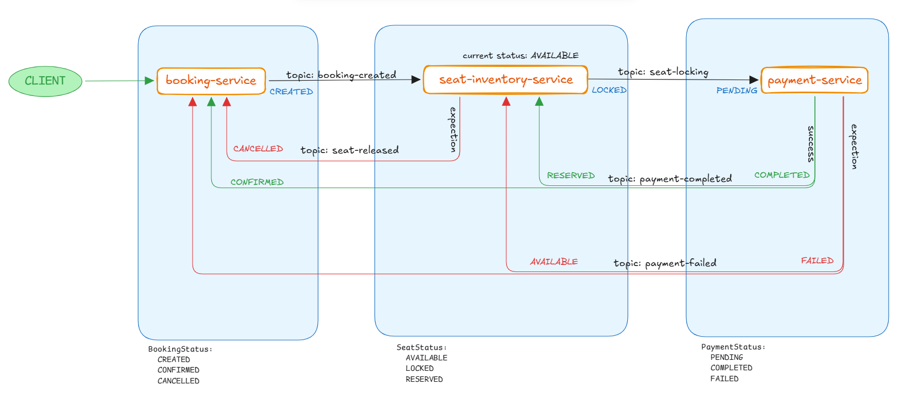

## Saga Pattern (Choreography) - Sinema Rezervasyon Sistemi

---

### Contents
 
- [Overview](#overview)
- [Technical Stack](#technical-stack)
- [Project Structure](#project-structure)
- [Booking Transaction Flow](#booking-transaction-flow)
- [Installation](#installation)
- [API Reference](#api-reference)

---

## Overview

**Saga Pattern | Choreography** yaklaşımını kullanılarak oluşturulmuş sinema koltuk rezervasyon sistemidir.
<br/>
Microservice mimaride distributed transaction işlemini `saga-pattern | choreography` ile yönetmek için hazırlandı.


* Bu proje; rezervasyon, ödeme ve koltuk envanteri yönetimini birbirinden bağımsız mikroservisler aracılığıyla gerçekleştirir.
* Servisler arası iletişim, merkezi bir orkestrator olmaksızın **event-driven** yaklaşımla sağlanır.
* Servisler birbirleriyle doğrudan haberleşmez; ortak event modelleri (booking-common-events) üzerinden mesajlaşır.

<p align="center">
    
</p>

---

## Technical Stack

 * Java 21
 * Spring Boot 3.5.x
 * Apache Kafka
 * PostgreSQL
 * Docker Compose

---
 
## Project Structure
 
```
saga-pattern-choreography/
│
├── booking-common-events/       # Servisler arası ortak event modelleri
│
├── booking-service/             # Rezervasyon servisi
│   └── src/main/java/.../
│       ├── controller/
│       ├── service/
│       ├── repository/
│       └── model/
│
├── payment-service/             # Ödeme servisi
│   └── src/main/java/.../
│
├── seat-inventory-service/      # Koltuk envanter servisi
│   └── src/main/java/.../
│
├── docs/                        
│   ├── init-scripts/
│   │   └── init.sql             # Veritabanı init scripti
│   └── insert-scripts/
│       └── data.sql             # Veri scripti
│
├── docker-compose.yml
└── .gitignore
```

- `booking-common-events/`
    - Servisler arası ortak event modelleri ve Kafka sabitleri barındırır.
- `booking-service/`
    - Rezervasyon isteğini alır, `booking-created` event'i yayınlar.
    - Port: `9191`
- `seat-inventory-service/`
    - `booking-created` event'ini dinler ve koltukları `LOCKED` durumuna geçirir.
    - `payment-completed` veya `payment-failed` event'leri ile koltuk doğrulama/iptal işlemlerini yönetir.
    - Port: `9292`
- `payment-service/`
    - `seat-locking` event'ini dinler, ödeme işlemini simüle eder.
    - Başarılıysa `payment-completed`, başarısızsa `payment-failed` event'i yayınlar.
    - Port: `9393`
- `init-scripts/init.sql`
    - PostgreSQL için başlangıç veritabanı tablolarını ve schema yapılandırmasını sağlar.
- `docker-compose.yml`
    - Kafka, Kafka UI ve PostgreSQL servislerini başlatır.

---

## Booking Transaction Flow

---

1. Kullanıcı `booking-service` üzerinden `POST /bookings` isteği gönderir.
2. `booking-service` veritabanına `Booking` kaydını ekler ve `booking-created` event'i yayınlar.
3. `seat-inventory-service` bu event'i dinler; istenen koltukların tamamı `AVAILABLE` ise onları `LOCKED` yapar.
4. `seat-inventory-service` daha sonra `seat-locking` event'i yayınlar.
5. `payment-service` bu event'i alır ve ödemenin işlenmesini simüle eder.
6. Ödeme başarılıysa `payment-completed`, başarısızsa `payment-failed` event'i yayınlanır.
7. `seat-inventory-service`:
    - `payment-completed` alırsa koltukları `RESERVED` yapar.
    - `payment-failed` alırsa koltukları tekrar `AVAILABLE` yapar ve `seat-released` event'i yayınlar.
8. `booking-service`:
    - `payment-completed` alırsa rezervasyonu `CONFIRMED` olarak günceller.
    - `seat-released` alırsa rezervasyonu `CANCELLED` olarak işaretler.

#### Kafka Topics

- `booking-created`
- `seat-locking`
- `seat-released`
- `payment-completed`
- `payment-failed`

#### Consumer Groups

- `movie-booking-event-group`
- `seat-inventory-event-group`
- `payment-event-group`


#### Booking Status
- `CREATED`
- `CONFIRMED`
- `CANCELLED`

#### Seat Status
- `AVAILABLE`  | Koltuk müsait, rezervasyon yapılabilir
- `LOCKED`     | Koltuk aktif bir oturum sırasında geçici olarak tutulmuş
- `RESERVED`   | Koltuk başarıyla rezerve edilmiş ve onaylanmış

#### Payment Status
- `PENDING`
- `COMPLETED`
- `FAILED`

---

## Installation

### Docker
 
```bash

# Repository Clone
git clone https://github.com/emregltkin/saga-pattern-choreography.git
cd saga-pattern-choreography
 
# Servisleri çalıştır
docker compose up -d
```

### Docker Services
- Kafka: `localhost:9092`
- Kafka UI: `http://localhost:8080`
- PostgreSQL: `localhost:5632`

### Database Scripts
 
`docs/init-scripts/init.sql` dosyası Docker compose ile otomatik olarak çalıştırılır.
Verileri eklemek için `docs/insert-scripts/data.sql` scripti çalıştırılır.
 
```sql
INSERT INTO seat_inventory (theater_id, screen_id, show_id, seat_number, status, booking_code, last_updated) VALUES
 
-- 🎬 Salon 1: Avengers Endgame (Akşam Seansı)
('THEATER_PVR_001', 'SCREEN_1', 'SHOW_101', 'A1', 'AVAILABLE', NULL, NOW()),
('THEATER_PVR_001', 'SCREEN_1', 'SHOW_101', 'A2', 'AVAILABLE', NULL, NOW()),
('THEATER_PVR_001', 'SCREEN_1', 'SHOW_101', 'A3', 'LOCKED',    'RSV_12345A01', NOW()),
('THEATER_PVR_001', 'SCREEN_1', 'SHOW_101', 'A4', 'RESERVED',  'RSV_12345A02', NOW()),
('THEATER_PVR_001', 'SCREEN_1', 'SHOW_101', 'A5', 'AVAILABLE', NULL, NOW()),
 
-- 🎬 Salon 2: Joker (Gece Seansı)
('THEATER_PVR_001', 'SCREEN_2', 'SHOW_202', 'B1', 'AVAILABLE', NULL, NOW()),
('THEATER_PVR_001', 'SCREEN_2', 'SHOW_202', 'B2', 'AVAILABLE', NULL, NOW()),
('THEATER_PVR_001', 'SCREEN_2', 'SHOW_202', 'B3', 'LOCKED',    'RSV_12345A03', NOW()),
('THEATER_PVR_001', 'SCREEN_2', 'SHOW_202', 'B4', 'AVAILABLE', NULL, NOW()),
('THEATER_PVR_001', 'SCREEN_2', 'SHOW_202', 'B5', 'RESERVED',  'RSV_12345A04', NOW()),
 
-- 🎬 Salon 3: Oppenheimer (Sabah Seansı)
('THEATER_PVR_002', 'SCREEN_3', 'SHOW_303', 'C1', 'AVAILABLE', NULL, NOW()),
('THEATER_PVR_002', 'SCREEN_3', 'SHOW_303', 'C2', 'LOCKED',    'RSV_12345A05', NOW()),
('THEATER_PVR_002', 'SCREEN_3', 'SHOW_303', 'C3', 'AVAILABLE', NULL, NOW()),
('THEATER_PVR_002', 'SCREEN_3', 'SHOW_303', 'C4', 'RESERVED',  'RSV_12345A06', NOW()),
('THEATER_PVR_002', 'SCREEN_3', 'SHOW_303', 'C5', 'AVAILABLE', NULL, NOW());
```
 
#### Örnek;
 
| Sinema ID       | Salon    | Seans ID | Film              |
|-----------------|----------|----------|-------------------|
| THEATER_PVR_001 | SCREEN_1 | SHOW_101 | Avengers: Endgame |
| THEATER_PVR_001 | SCREEN_2 | SHOW_202 | Joker             |
| THEATER_PVR_002 | SCREEN_3 | SHOW_303 | Oppenheimer       |
 
---

## API Reference
 
#### Rezervasyon Oluştur

Belirli bir seans için bir veya birden fazla koltuk rezervasyonu yapar.

```
POST /bookings
```

**cURL:**

```bash

curl --request POST 'http://localhost:9191/bookings' \
  --header 'Content-Type: application/json' \
  --data '{
    "userId": "USER_1",
    "showId": "SHOW_101",
    "seatIds": ["A1"],
    "totalAmount": 100
  }'
```

---

